# Unlocking the power of the browser dev tools
This repository is a companion to a presentation demonstrating how to use the development tools built into modern browsers. 


## About this sample application
The sample application is a simple web application which demonstrates some of the features of the browser dev tools.

To run the sample application, you'll need to install [Node.js](https://nodejs.org/en/). Once you've installed Node.js, you can run `npx http-server` to start the application. Then navigate to `http://localhost:8080` in your browser.

## Console
Console output is one of the simplest ways to see the state of your application at run-time. Use the following console
functions to output data. This section outlines some of the most useful functions in the console object. For complete documentation please see the [MDN documentation](https://developer.mozilla.org/en-US/docs/Web/API/Console).

To see the console output, open the browser dev tools and select the Console tab.

### console.log()
`console.log()` is the most basic console function. Data passed into this function will be output to the console.

Example:
```javascript
console.log('Hello World');
```

### console.assert()
The console.assert() method logs a message to the console if an assertion is false. 
If the assertion is true, nothing is logged to the console.

Consider the following example:
```javascript
console.assert(1 === 2, '1 does not equal 2');
```

The output in the console shows the message and the stack trace. It looks like this:
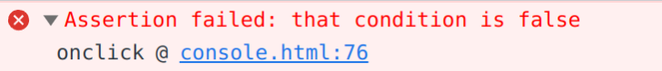

### console.dir()
`console.dir()` is used to output a JavaScript object to the console. This function will output the object in a tree, making it useful for nested data.

Example:
```javascript
    crab = {ageInYears:2.1, name:"monster", type:"hermit crab", 
        origin: {country:"United States", state:"New Jersey", city:"Ocean City"}};
    console.dir(crab);
```

The output from this example would look something like this:

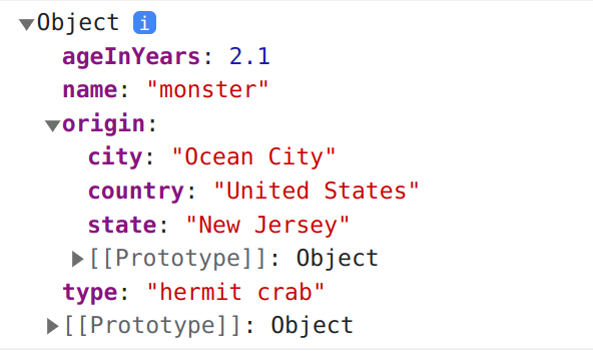


### console.table()
`console.table()` is used to output an array of objects to the console. This function will output the array as a table, making it useful for tabular data.

Example:
```javascript
    crabs = [
        {ageInYears:2.1, name:"monster", type:"hermit crab"}, 
        {ageInYears:1.5, name:"crabby", type:"hermit crab"},
        {ageInYears:1.2, name:"crabzilla", type:"hermit crab"}
    ];
    console.table(crabs);
```

The output from this example looks like this:
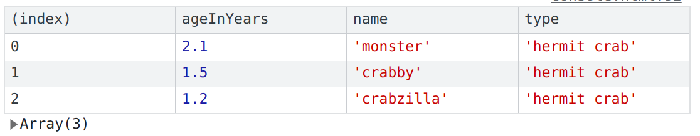


## console.info(), console.trace(), console.warn(), console.debug(), console.error()

Consider the following example:
```javascript
console.info('This is an info message');
console.trace('This is a trace message');
console.warn('This is a warning message');
console.debug('This is a debug message');
console.error('This is an error message');
```

Running this example yeilds the following output:
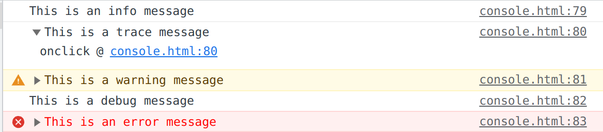

### console.time() and console.timeEnd()

```javascript
console.time('timer');
setTimeout(() => {
    console.timeEnd('timer');
}, 1000);

```

The output in the console shows the name of the timer and the 
time (in milliseconds) it took to execute the code block.
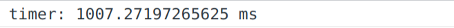


## Storage
There are several ways in which data is stored in the browser. The most effective way to 
examine the state of that storage is to utilize the browsers dev tools. In this sample application, click on the Storage link on the top bar. Try each each example to see cookies, local storage and session storage in action. The bowser dev tools also support IndexedDB and WebSQL, which are not included in this sample application.

### Cookies
To view the cookies associated with a particular website, navigate to the site, open the dev tools, and select cookies in the Storage panel. You'll need to refresh the panel to see changes to the 
cookies. You can see the name, value and expiration date of each cookie. You can also manipulate cookies from this panel.

The screenshot below shows this tool in Chromium-based browsers.
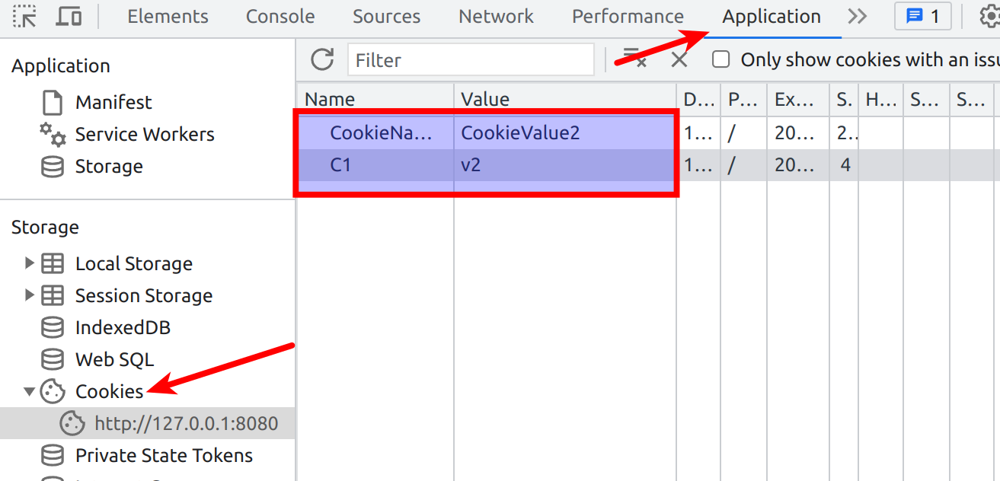

### Local Storage
To view the local storage associated with a particular website, navigate to the site, open the dev tools, and select local storage in the Storage panel. Data placed in local storage 
will persist until it is cleared by the user or the application.

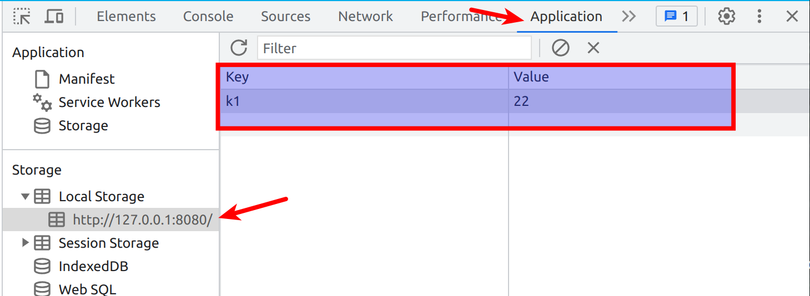

### Session Storage
To view the session storage associated with a particular website, navigate to the site, open the dev tools, and select session storage in the Storage panel. You will notice that 
session storage is cleared when you close the browser tab.

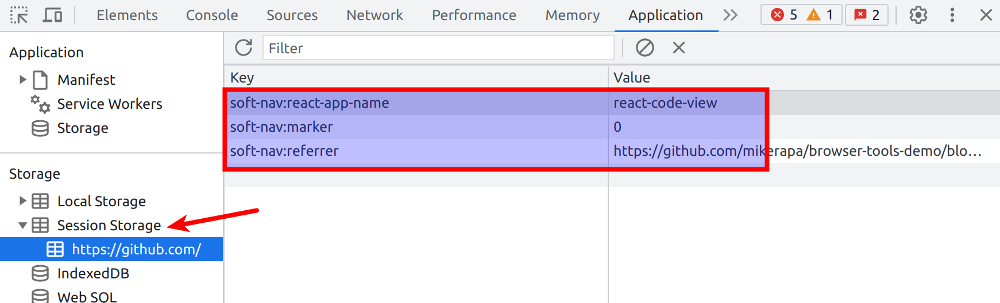


## Memory
The memory panel in the browser dev tools allows you to see the memory usage of your application. 

To get started, I recommend selecting the 'Heap Snapshot' option from the 
main memory screen and taking a snapshot. You can then use the 'Summary' tab to see the memory usage of your application. Once you're ready, you can 
collect a second snapshot and use the 'Comparison' option to see the differences between 
the snapshots.

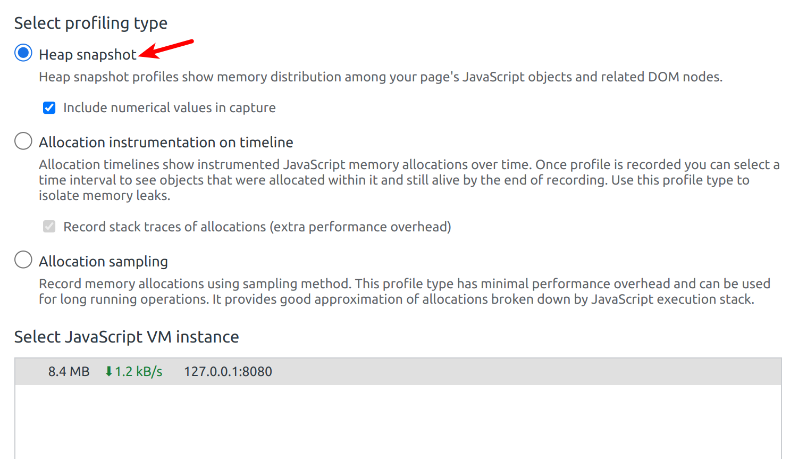

See the [Chrome Dev Tools documentation](https://developer.chrome.com/docs/devtools/memory-problems/heap-snapshots/) for more information on the memory panel. 


## Performance 
Open the Performance panel in your browser dev tools. The browser doesn't continuously record performance data, so you'll need to click the record button to start recording, and click stop to end the recording.

If you're using the sample application, navigate to the Performance tab and click the Animate button. 
When the recording has stopped, will see a lot of information has been captured, including the following:

1. A graph of CPU activity
2. A graph of network activity 
3. Progressive screen shots showing the visual state
4. A graph of memory usage over time. 
5. A dial chart showing the percentage time spent in the scripting, rendering, painting and other categories of utilization. 
6. A call tree, also showing percentages of utilization. 
7. Event list.

This tool can be used to diagnose run-time performance issues as well as slowness associated with the first time load of a web application. For more information about how to use the tool, see the [Chrome Dev Tools documentation](https://developer.chrome.com/docs/devtools/performance/). 


## Network
The network panel in the browser dev tools allows you to see the network activity of your application.
Start the recording by clicking the record button. Then, refresh the page, and click on the Get User Data
Button, and stop the recording. You should see a list of network requests that were made, along with status,
size, and timing information.

If you're using the sample application, the panel should look something like this:
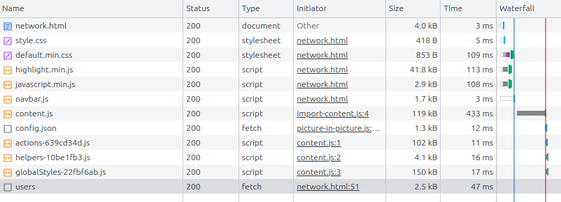

## Elements and Styles
The Elements tab of the browser dev tools allows you to see the HTML and CSS of your application. You can also use this tab to inspect the DOM and CSS rules.

To use the sample application, try the following:
1. Open the browser dev tools and navigate to the Elements tab.
2. In the sample app, click on the Elements link on the top bar. 
3. Click on the Start Timer button and look for the element which is blinking, indicating that it's changing.
4. You can also see all elements on the page as they are rendered. 

Explore the Elements tab, include the styles panel. 

The Styles panel will display all of the styles pertaining to the selected element. It should look something like the following, if you have the gray box selected. 

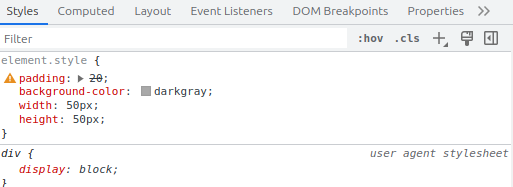

Each style can be enabled or disabled with a checkbox on the left of each line. 


## Sources 
The Sources tab allows you to see the JavaScript, HTML, images and other files that make up a web application. You can also use this tab to set breakpoints, inspect variables, 
and step through the code. If your application has TypeScript, you can also see the source maps in this tab.

To use the sample application to see the Sources tab in action, do the following:
1. Open the browser dev tools and navigate to the Sources tab.
2. In the sample app, click on the Source link on the top bar. Click on the Start Timer button and you should see a counter increasing every second. 
3. In the browser dev tools Sources tab, click on the source.html file in the list of files. 
4. Find the line of code which contains `count++` and set a breakpoint on that line by clicking on the line number.

From there you can step through the code and inspect variables. 

## Sensors
The Sensors tab of the browser dev tools allows you to simulate different sensors on a device.
This is useful for testing applications which use sensors, such as GPS, accelerometer, and others.

In the sample application, click on the Sensors link on the top bar. Change the location and 
orientation of the device and see the values update in the application.

## Framework-specific tools
If you're using a modern JavaScript SPA framework, such as Angular or React, you may find it difficult to examine the memory usage, performance or state using the tools built into the browser. That's because those frameworks utilize many functions and variables in the framework to manage the state and life-cycle of the components. Fortunately, most of those SPA frameworks have browser plugins, which enhance the browser dev tools.

For example, there is a browser plugin for React called [React Developer Tools](https://chrome.google.com/webstore/detail/react-developer-tools/fmkadmapgofadopljbjfkapdkoienihi?utm_source=ext_sidebar&hl=en-US). This plugin adds a few React tabs to the browser dev tools, which allows you to see the state of your React application, including the hierarchy of components and the state of each component. Without such a plugin, the dev tools do not understand enough about React to properly represent the components.

If you're developing an application with a SPA framework, I recommend searching for a browser plugin for that framework. Get familiar with the tools that are available for your framework.